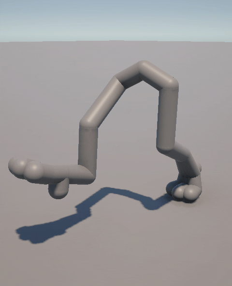

# Spring IK


[](https://docs.unity3d.com/Packages/com.unity.animation.rigging@1.4/manual/index.html)
[](LICENSE)

**IK Spring Solver for Unity.**



Normal IK bends a leg in one place. Animal legs bend in two — the knee goes forward, the
hock (the backwards-pointing ankle) goes back. Spring IK does that, and lets you choose
how much of the bend goes to each one.

Any 3-bone chain: dog and horse legs, bird legs, mech legs.

---

## Under the hood

- **A custom Animation Rigging constraint.** The solve runs in a
  [Burst-compiled animation job](UnitySpringIK/Assets/SpringIK/Runtime/SpringIKConstraintJob.cs)
  and writes rotation deltas only, so it layers on top of existing animation instead of
  replacing it.
- **Closed-form limits, fixed-cost solve.** [`SpringIKMath`](UnitySpringIK/Assets/SpringIK/Runtime/SpringIKMath.cs)
  computes the reach limits exactly and solves the bend in a fixed 8 bisection + 4 Newton
  steps: deterministic and allocation-free.
- **One knob that keeps its promise.** Spring Angle Bias sets how the bend splits between
  knee and hock, and that split holds as the leg compresses.
- **It tells you why the foot won't reach.** A live Inspector readout shows the reachable
  window and what the current bias costs you.
- **Tested.** [13 EditMode tests](UnitySpringIK/Assets/SpringIK/Tests/Editor/SpringIKMathTests.cs)
  on the solver. Every sweep also checks that it really hit the case it claims to test.

---

## Install

**Window → Package Manager → + → Install package from git URL…** and paste:

```
https://github.com/Garegni/UnitySpringIK.git?path=/UnitySpringIK/Assets/SpringIK#v1.0.0
```

Needs **Unity 6** (6000.0.23f1 or newer). Animation Rigging installs itself along with it.
The `#v1.0.0` at the end pins this release; leave it off to get the latest changes instead.

---

## Try the demo

Clone this repo, open the `UnitySpringIK` folder with **Unity 6000.6** or newer, and open
`Assets/Scenes/SpringIKScene`. It's the walk from the GIF above.

---

## Rig a leg

1. Select your character. Menu: **Animation Rigging → Rig Setup**. You get a `Rig 1` object.
2. Right-click `Rig 1` → **Create Empty**. Call it `SpringIK`.
3. On it: **Add Component → Animation Rigging → Spring IK Constraint**.
4. Drag your **foot bone** into the **Tip** slot. Only that one.
5. Click the **⋮** menu at the top-right of the component → **Auto Setup from Tip Transform**.

That's it. It walks up the chain, fills in the other three bones, and creates three
objects for you: `SpringIK_target`, `SpringIK_kneeHint`, `SpringIK_hockHint`.

**Move `SpringIK_target` and the leg follows.** The two hints control which way each joint
bends — move them if a joint bends the wrong way.

---

## The one knob: Spring Angle Bias

Where the bend goes.

| | |
|---|---|
| **−1** | all the bend up top, at the knee |
| **0** | split evenly between both |
| **+1** | all the bend down low, at the hock |

Drag it and watch the leg. You can animate it like any other value.

---

## If the foot won't reach

The constraint tells you. Select it and look at the **Reach (live)** box at the bottom of
the Inspector. If the target is too close, you get:

> Target is 0.600 away — inside the fold limit (1.700) at this bias.
> The chain holds at maximum fold.

Now drag **Spring Angle Bias** and watch that fold limit change.

This catches people out: **0 is not always the best setting.** On a leg with a short
middle bone, 0 is the *worst* — the readout will say something like *"this bias costs 52%
of travel"* — while 0.75 folds all the way down. It depends on your bone lengths. Drag the
slider until the number is small enough and the warning goes away.

---

## Every setting

| | |
|---|---|
| **Root, Knee, Hock, Tip** | the four bones, top to bottom. Auto Setup fills these in. |
| **Target** | where the foot should go. Move this to pose the leg. |
| **Knee Hint / Hock Hint** | which side each joint bends toward. |
| **Spring Angle Bias** | where the bend goes. See above. |
| **Target Position Weight** | how much the foot follows the target. 0 = ignore it. |
| **Target Rotation Weight** | how much the foot copies the target's rotation. |
| **Knee / Hock Hint Weight** | how strongly each hint steers. |
| **Weight** | overall strength. 0 turns the constraint off completely. |

---

Made by **José Ignacio Alonso Kuri** · PixelCyto · [LinkedIn](http://linkedin.com/in/alonsokuri) · [GitHub](https://github.com/Garegni) · [Sketchfab](http://sketchfab.com/egni) · [ArtStation](https://egni.artstation.com/)


MIT licensed.
